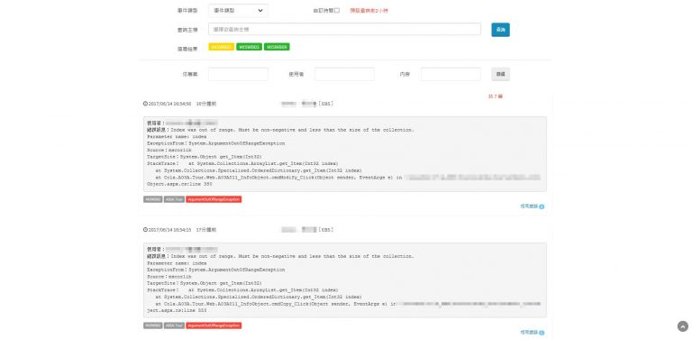

公司已離職的傳說級神人大大留下來的事件檢視器因為公司資安問題而大調權限後掛了，因此我被指派想辦法生一個新的事件檢視器。  
這邊為了可以掛內部系統目錄就把它砍掉重練成 Webform 了 (人家是用 Angular MVC 不然我也想跟著潮潮看的說 XD  
原本調權限前我就修了一個執行檔讓它每天把當日的 Eventlog 記到資料庫 table 裡，這樣查歷史資料可以快很多，但調權限前完成沒多久後也用不到了。(泣

以下是其中 C# 撈事件檢視器資料的 Code

```csharp
// 取得主機列表
List <Machine> machines = db.Machine.Where(x => x.Web_Type == web.Web_Type).ToList();

Parallel.ForEach(machines, machine => {

    ManagementScope scope = new ManagementScope("\\\\" + machine.Machine_Name + "\\root\\cimv2");
    scope.Connect();

    string startTime = ManagementDateTimeConverter.ToDmtfDateTime(DateTime.Parse(web.Last_Update_Date.ToString("yyyy/MM/dd 00:00:00")));
    string endTime = ManagementDateTimeConverter.ToDmtfDateTime(DateTime.Parse(DateTime.Now.Date.ToString("yyyy/MM/dd 00:00:00")));

    string query = "SELECT * FROM Win32_NTLogEvent WHERE (Logfile = '電子商務' OR Logfile = 'Application') AND TimeWritten >= '" + startTime + "' AND TimeWritten <= '" + endTime + "'";

    WqlObjectQuery wqlQuery = new WqlObjectQuery(query);
    ManagementObjectSearcher searcher = new ManagementObjectSearcher(scope, wqlQuery);
    ManagementOperationObserver observer = new ManagementOperationObserver();

    bool isComplete = false;

    observer.ObjectReady += new ObjectReadyEventHandler((sender, args) => {
        ManagementObject newObject = (ManagementObject) args.NewObject;

        EventLog eventLog = new EventLog {
            Web_Type = web.Web_Type,
                Machine_Name = machine.Machine_Name,
                Event_Time = ManagementDateTimeConverter.ToDateTime(newObject["TimeWritten"].ToString()),
                Event_Category = newObject["Category"] == null ? 0 : int.Parse(newObject["Category"].ToString()),
                Event_Code = newObject["EventCode"] == null ? 0 : int.Parse(newObject["EventCode"].ToString()),
                Log_File = newObject["Logfile"] == null ? "" : newObject["Logfile"].ToString().Trim(),
                Record_No = newObject["RecordNumber"] == null ? 0 : int.Parse(newObject["RecordNumber"].ToString()),
                Source_Name = newObject["SourceName"] == null ? "" : newObject["SourceName"].ToString().Trim(),
                Event_Type = newObject["Type"] == null ? "" : newObject["Type"].ToString().Trim(),
                Event_Message = newObject["Message"] == null ? "" : newObject["Message"].ToString().Trim(),
                Event_Project = GetProjectName(newObject["Message"] == null ? "" : newObject["Message"].ToString().Trim()),
                Message_Category = GetMessageCategory(newObject["Message"] == null ? "" : newObject["Message"].ToString().Trim())
        };

        eventLogList.Add(eventLog);
    });

    observer.Completed += new CompletedEventHandler((sender, args) => {
        isComplete = true;
    });

    searcher.Get(observer);

    while (!isComplete) {
        System.Threading.Thread.Sleep(1000);
    }

});
```
