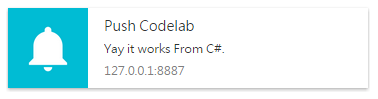

最近稍微看了一下推播通知的部分，這邊簡單分享一下我看的相關資源以及我的待看清單。XD  
如果真的有實作有機會再補上筆記…

> 隨著行動和穿載裝置的興起，推播通知 (Push Notification) 成為維繫 App 用戶關係相當有力的工具。  
[簡單 4 步驟，App 推播不惱人還找回用戶的心](簡單4步驟，App推播不惱人還找回用戶的心)

## Service Worker

是一種由 Javascript 編寫的瀏覽器端代理腳本，位於瀏覽器和服務器之間（後台運行的腳本，環境與一般腳本不同），不能直接參與 web 的交互行為。Service Worker 的事件驅動和可以用來管理緩存，使得 web app 擁有與 native app 相同的離線體驗、消息推送、後台自動更新等體驗。  

[MDN ServiceWorker](https://developer.mozilla.org/zh-TW/docs/Web/API/ServiceWorker)  
[Service Worker:讓網頁無網絡也能訪問](https://read01.com/AARPmO.html)  
[PWA 實踐：理解和創建 Service Worker 腳本](https://read01.com/NA4oxP.html)  

## Progressive Web App (PWA)

[Adding Push Notifications to a Web App](https://developers.google.com/web/fundamentals/getting-started/codelabs/push-notifications/?hl=zh-tw)  
[30 天 Progressive Web App 學習筆記](http://ithelp.ithome.com.tw/users/20071512/ironman/1222)

## Firebase Cloud Messaging (FCM)

發送通知到 Android/ iOS 手機。

## Google Cloud Messaging (GCM)

FCM 的前身。

我是跟著 Google Developers 的這篇 Adding Push Notifications to a Web App 照做的，步驟單純且很詳細。  
這邊可以參考不同語言的 Web Push 寫法，我是在 Webform 的 Button 用 C# 寫的，有成功 😀  


```csharp
protected void cmdQuery_Click(object sender, EventArgs e)
{
    var pushEndpoint = @"https://fcm.googleapis.com/fcm/send/cAKHtKxF4lI...";
    var p256dh = @"BGYGZ_M9LVg0Ib...";
    var auth = @"vE44l...";

    var subject = @"mailto:example@example.com";
    var publicKey = @"BK8juAE3Hgvqaef297gFJPm...";
    var privateKey = @"Qe8qv7BmIzxGOer70i4...";

    var subscription = new PushSubscription(pushEndpoint, p256dh, auth);

    var options = new Dictionary<string, object>();
    options["vapidDetails"] = new VapidDetails(subject, publicKey, privateKey);
    //options["gcmAPIKey"] = @"[your key here]";
    var payload = "{\"body\": \"Yay it works From C#.\",\"icon\": \"images/icon.png\",\"badge\": \"images/badge.png\"}";

    var webPushClient = new WebPushClient();
    try
    {
        webPushClient.SendNotification(subscription, payload, options);
    }
    catch (WebPushException exception)
    {
        Console.WriteLine("Http STATUS code" + exception.StatusCode);
    }
}
```
